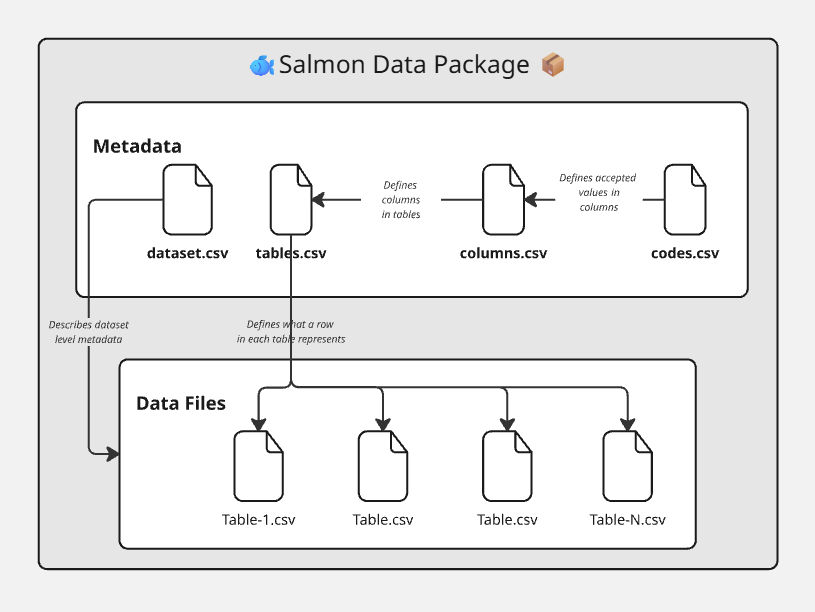

**Canonical specification (Markdown):** [Salmon data package specification](https://github.com/dfo-pacific-science/smn-data-pkg/blob/main/SPECIFICATION.md)

This page is a high-level overview of the workflow. For complete package details and field requirements, use the canonical specification above.

```{=html}
<section class="semantic-system-hero">
  <p class="semantic-system-eyebrow">DFO Pacific Science • Data Stewardship Unit</p>
  <h2>The front door for salmon data integration workflows</h2>
  <p>
    Use one system, one order: ontology terms, package metadata, metasalmon review, optional guided review, and package-first SPSR intake.
  </p>
  <div class="semantic-system-cta-row">
    <a class="semantic-system-cta semantic-system-cta-primary" href="../../how_to_guides/fsar-to-spsr-end-to-end-example.qmd">Start my FSAR intake path</a>
    <a class="semantic-system-cta" href="ontology-data-package-gpt.qmd">Go to salmon data package + guided review + SPSR intake path</a>
  </div>
</section>
```

```{=html}
<div class="status-badge-row">
  <span class="status-badge status-canonical">Canonical Workflow</span>
  <span class="status-badge status-active">Operational</span>
  <span class="status-badge status-guidance">Contributor Friendly</span>
</div>
```

## The system flow

```{=html}
<div class="semantic-system-flow" role="list" aria-label="Salmon Data Integration System flow">
  <div class="semantic-system-node" role="listitem">
    <h3>1) DFO Salmon Ontology</h3>
    <p>Use canonical term definitions and IRIs.</p>
    <a href="../ontology/formal-documentation.qmd">Open ontology docs</a>
  </div>
  <div class="semantic-system-arrow" aria-hidden="true">→</div>
  <div class="semantic-system-node" role="listitem">
    <h3>2) Salmon data package</h3>
    <p>Package data and metadata in the canonical `metadata/` + `data/` layout.</p>
    <a href="salmon-data-exchange-package.qmd">Open SDP spec</a>
  </div>
  <div class="semantic-system-arrow" aria-hidden="true">→</div>
  <div class="semantic-system-node" role="listitem">
    <h3>3) metasalmon</h3>
    <p>Create, review, and validate the package before intake.</p>
    <a href="../../tools.qmd">Open tools page</a>
  </div>
  <div class="semantic-system-arrow" aria-hidden="true">→</div>
  <div class="semantic-system-node" role="listitem">
    <h3>4) Guided review (optional)</h3>
    <p>Use SMN-GPT or another constrained assistant for ambiguity triage after the package exists.</p>
    <a href="ontology-data-package-gpt.qmd">See package-first intake guidance</a>
  </div>
  <div class="semantic-system-arrow" aria-hidden="true">→</div>
  <div class="semantic-system-node" role="listitem">
    <h3>5) SPSR Intake</h3>
    <p>Use the package-first wizard or bulk route for CU/composite, SMU, or Population uploads.</p>
    <a href="https://spsr.dfo-mpo.gc.ca/wizard/1/">Open SPSR upload wizard</a>
  </div>
</div>
```

## Salmon data package overview (diagram)

{fig-alt="Conceptual diagram of salmon data package metadata files linked to table data files." fig-align="center"}

::: {.callout-note}
The diagram is conceptual. The current canonical layout groups metadata files under `metadata/`, data tables under `data/`, and may include an optional root `datapackage.json`.
:::

## What to use this page for

- new contributors who need the shortest correct path
- analysts preparing FSAR datasets for submission
- reviewers checking if a package is intake-ready

## Quick launch paths

- [Start my FSAR intake path](../../how_to_guides/fsar-to-spsr-end-to-end-example.qmd)
- [FSAR Data Standardization Workflow](../../how_to_guides/fsar-data-standardization-workflow.qmd)
- [Salmon data package + guided review + SPSR intake path](ontology-data-package-gpt.qmd)
- [CU/composite escapement estimates for package-first SPSR intake](../../cookbook/cu-composite-escapement-estimates.qmd)
- [The Semantic Salmon Data Ecosystem (deeper architecture)](semantic-salmon-data-ecosystem.qmd)
